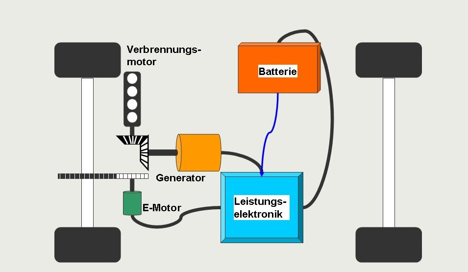
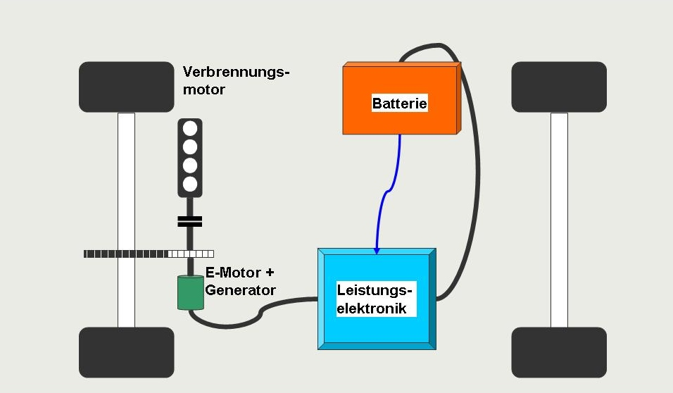
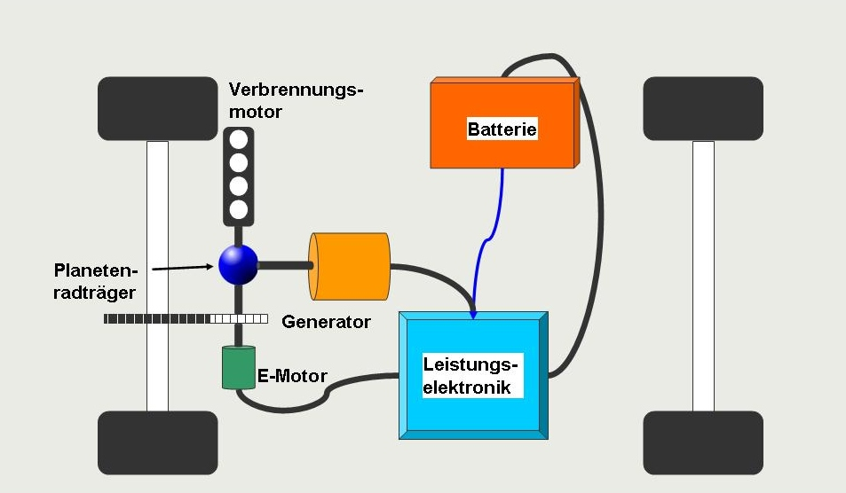

---
title:
- Hybridauto
subtitle:
- Hybridelektrofahrzeug
author:
- Jonathan Günther, Luke Addis und Emir Özdemir
theme:
- Luebeck
---

# Inhaltsverzeichnis

   * [Inhaltsverzeichnis](#inhaltsverzeichnis)
   * [Definition-Wortherkunft](#definition-wortherkunft)
      * [Definition](#definition)
      * [Wortherkunft](#wortherkunft)
   * [Grundlegende Technik](#grundlegende-technik)
      * [Vereinfachte Systemstruktur](#vereinfachte-systemstruktur)
      * [Plug-in-Hybrid](#plug-in-hybrid)
   * [Einteilung nach Systemstruktur](#einteilung-nach-systemstruktur)
      * [Serieller Hybrid -Grafik](#serieller-hybrid--grafik)
      * [Paralleler Hybrid -Grafik](#paralleler-hybrid--grafik)
      * [Leistungsverzweigter Hybrid - Grafik](#leistungsverzweigter-hybrid---grafik)
   * [Einteilug nach Elektrischer Leistung](#einteilug-nach-elektrischer-leistung)
      * [<strong>Mild</strong>hybrid](#mildhybrid)
      * [<strong>Voll</strong>hybrid](#vollhybrid)
   * [Vor- und Nachteile:](#vor--und-nachteile)
      * [Vorteile:](#vorteile)
      * [Nachteile](#nachteile)
   * [Quellen](#quellen)

# Definition-Wortherkunft
## Definition

> Ein **Hybridelektrokraftfahrzeug**(Hybridauto) ist ein Fahrzeug, dass mindestens von einem **Elektromotor** und einem **anderen Motor**(meist Verbrennungsmotor) angetrieben wird.

## Wortherkunft

Hybrid = hybrida(lat.) = Mischling

# Grundlegende Technik

## Vereinfachte Systemstruktur
- Batterie speichert Energie und versorgt Generator.
- Oft dient Verbrennugsmotor um Generator anzutreiben.
- Generator treibt Elektromotor an. 
- Elektromotor arbeitet mit Verbrennugsmotor.
- Fast immer wird Bremsenergie genutzt um Energie zurückzugewinnen.

## Plug-in-Hybrid
- PHEV = Plug-in-Hybrid: Batterie wird über Stromnetzt geladen um Reichweite zu erhöhen.

## Elektromotor 
 > **Elektromotoren wandeln elektrische Energie in Bewegungsenergie um mithilfe von Magnetfelder**. 

# Einteilung nach Systemstruktur
> Es gibt grundlegend 3 Systemstrukturen von Hybridfahrzeugen:

## 3. **Leistungsverzweigter** Hybrid: Verbrennungsmotor und Elektromotor wechseln zwischen seriellen und parallelen Betrieb je nach **Bedarf**.
 1. **Serieller** Hybrid: Verbrennungsmotor **versorgt** Batterie, diese den Elektromotor.
 2. **Paralleler** Hybrid: Verbrennungs und Elektromotor arbeiten **parallel** zusammen.

# Serieller Hybrid -Grafik

# Paralleler Hybrid -Grafik

# Leistungsverzweigter Hybrid - Grafik

# Einteilug nach Elektrischer Leistung

  > (Elektrische -)**Hybridautos werden auch nach ihrer Elektrischen Leistung eingeteilt.**

## **Mild**hybrid 
  - Elektroantrieb unterstützt Verbrennugsmotor.
  - 6 - 14 kW/h Leistung

## **Voll**hybrid 
  - Können rein Elektrisch fahren 
  - 20< kW/h

# Vor- und Nachteile: 

## Vorteile: 

- Stop and Go - "Technologie"
- Umweltschonend 
- Mehr leistung
- Leise
- Subventionen

## Nachteile:

- Wenige ladestation
- Schwerres Auto da 2 Motoren und Batterie.
- geringe Reichweite (Elektromotor)
- Teuer
- Batterien entladen sich bei kälte.

# Quellen:
## Webseiten
- [Wikipedia.org/hybridauto](https://de.wikipedia.org/wiki/Hybridelektrokraftfahrzeug)
- [elektroauto-hybridauto.de](http://www.elektroauto-hybridauto.de)
- [Auto-Welt.de](https://www.die-auto-welt.de/ratgeber/hybridfahrzeuge-vor-und-nachteile)
- [hybridauto.de](hybridauto.de)
- [wikimedia.de(Bilder)](commons.wikimedia.org/wiki/File:Prius2004.JPG)

## Lektüren:
  - Bruckhaus Enzeklopädie
